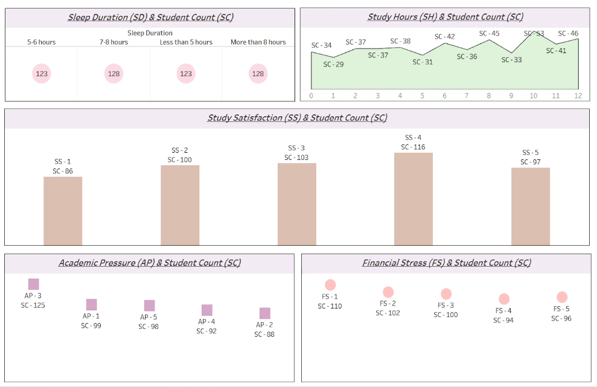

# 📊 Student Depression Analysis (SQL + Tableau)

## 📌 Project Overview
This project analyzes student depression data to identify key factors affecting mental health such as academic pressure, financial stress, sleep patterns, and study habits.

The analysis was performed using SQL for data cleaning and transformation, and Tableau for visualization and dashboard creation.

---

## 🎯 Objectives
- Analyze factors contributing to student depression
- Identify patterns in academic and lifestyle habits
- Build an interactive dashboard for insights

---

## 🛠 Tools & Technologies
- SQL Server (Data Cleaning & Transformation)
- Tableau Desktop (Data Visualization)
- Tableau Cloud (Dashboard Publishing)
- Excel (Dataset)

---

## 📂 Project Structure
```
data/
│   └── student_depression.csv
sql/
│   └── queries.sql
tableau/
│   └── student-depression-dashboard.twbx
images/
│   └── dashboard.png
README.md
```

---

## 🔧 Data Cleaning & Transformation
- Standardized Gender column (Male → M, Female → F)
- Created Age Groups (A1: 18–24, A2: 25–30, A3: 30+)
- Added Index Column for unique identification
- Converted Depression column (0/1 → No/Yes)

---

## 📊 Key Analysis Performed
- Academic Pressure vs Student Count
- Financial Stress vs Student Count
- Study Satisfaction vs Student Count
- Sleep Duration vs Student Count
- Study Hours vs Student Count

---

## 📈 Dashboard


👉 *Interactive dashboard built using Tableau*

---

## 🔍 Key Insights
- Higher academic pressure correlates with increased depression levels
- Financial stress significantly impacts student mental health
- Poor sleep duration is linked with higher depression rates
- Study satisfaction plays a major role in emotional well-being

---

## 🚀 How to Use
1. Run SQL queries from `/sql/queries.sql`
2. Load cleaned data into Tableau
3. Open `.twbx` file to view dashboard

---

## 📌 Conclusion
This project highlights how academic, financial, and lifestyle factors contribute to student depression, helping stakeholders make data-driven decisions for better student well-being.

---

## 👩‍💻 Author
Neha Sonar
